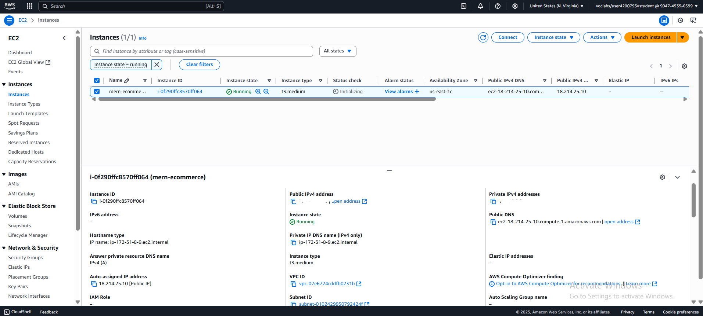
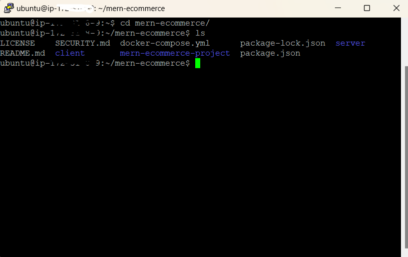
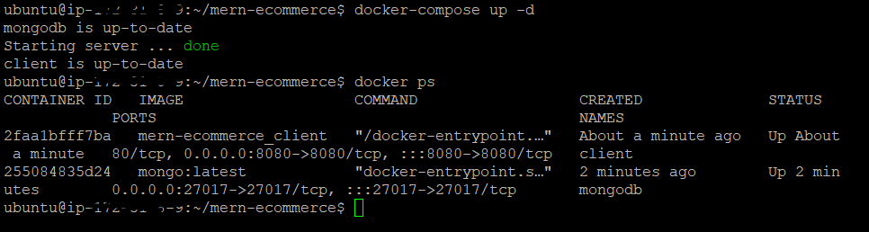
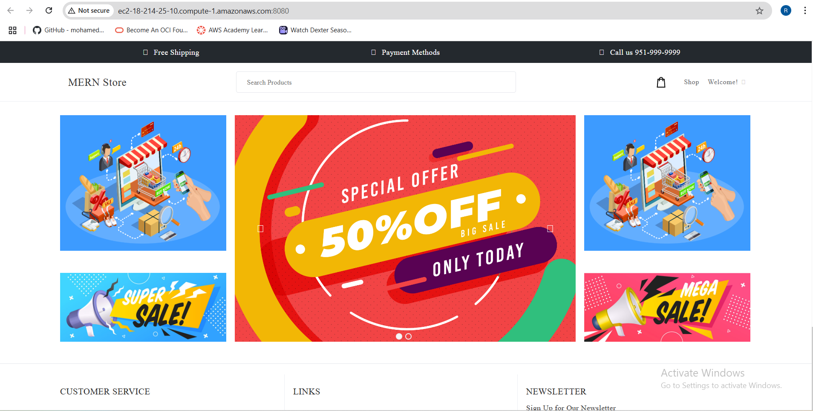

# MERN E-commerce Project (Optimized)

## Overview
A scalable, secure e-commerce platform built with the MERN stack (MongoDB, Express.js, React, Node.js).  
**Deployed on AWS EC2 with Docker, Nginx, and HTTPS.**

## Features
- Buyer: Browse categories, products, brands
- Seller: Manage brands (CRUD)
- Admin: Full store management (users, products, analytics)

## Tech Stack
- Backend: Node.js, Express.js, Mongoose
- Frontend: React, Redux, Tailwind CSS
- Database: MongoDB Atlas
- Deployment: AWS EC2, Docker, Nginx, Let’s Encrypt

## Deployment Instructions

### 1. Clone the Repository
```sh
git clone https://github.com/yourusername/mern-ecommerce-project.git
cd mern-ecommerce-project
```

### 2. Environment Variables
Create `server/.env` with:
MONGO_URI=your-mongodb-uri
JWT_SECRET=your-jwt-secret
MAILGUN_API_KEY=your-mailgun-key
MAILGUN_DOMAIN=your-mailgun-domain

### 3. Build and Run with Docker
```sh
docker-compose up --build -d
```

### 4. Nginx + HTTPS Setup (on EC2)
- Install Nginx:
  ```sh
  sudo apt update
  sudo apt install nginx -y
  ```
- Configure Nginx as a reverse proxy (see `nginx.conf` example below).
- Open ports 80 and 443 in your AWS security group.
- Install Certbot and get a free SSL certificate:
  ```sh
  sudo apt install certbot python3-certbot-nginx -y
  sudo certbot --nginx -d your-ec2-public-dns
  ```

### 5. Security Hardening
- Create a non-root user:
  ```sh
  sudo adduser rayen
  ```
- Set permissions:
  ```sh
  sudo chown rayen:rayen /home/ubuntu/mern-ecommerce
  sudo chmod 750 /home/ubuntu/mern-ecommerce
  ```
- Enable UFW and fail2ban:
  ```sh
  sudo ufw allow 22
  sudo ufw allow 80
  sudo ufw allow 443
  sudo ufw enable
  sudo apt install fail2ban -y
  sudo systemctl enable fail2ban
  sudo systemctl start fail2ban
  ```

## Nginx Reverse Proxy Example (`/etc/nginx/sites-available/default`)
```nginx
server {
    listen 80;
    server_name your-ec2-public-dns;

    location / {
        proxy_pass http://localhost:3000;
        proxy_set_header Host $host;
        proxy_set_header X-Real-IP $remote_addr;
        proxy_set_header X-Forwarded-For $proxy_add_x_forwarded_for;
        proxy_set_header X-Forwarded-Proto $scheme;
    }
}
```
- After editing, reload Nginx:
  ```sh
  sudo systemctl reload nginx
  ```

## Screenshots

Below are key steps and results from deploying and running the MERN E-commerce project on AWS EC2 with Docker Compose.

### 1. Docker Compose Up

This screenshot shows the successful startup of all services (`mongodb`, `server`, and `client`) using Docker Compose.



### 2. Running Containers

A snapshot of the running Docker containers, confirming that all services are up and mapped to their respective ports.



### 3. Application Home Page

The application is accessible from the browser via the EC2 public IP and mapped port, confirming a successful deployment.



### 4. Application Features Example

A demonstration of a key feature or page within the application, such as the dashboard, product listing, or admin panel.



## Next Steps / Future Work
- Add custom domain and ELB for production
- Set up CI/CD (GitHub Actions)
- Add monitoring/logging (CloudWatch)
- Prepare for auto-scaling

## License
MIT

